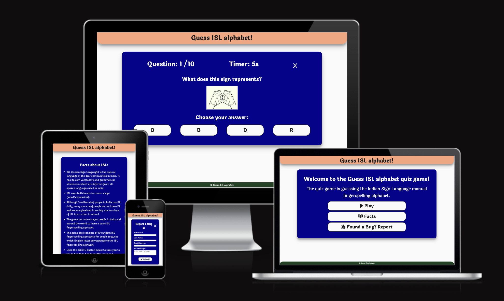

# [GUESS INDIAN SIGN LANGUAGE ALPHABET](https://robizman.github.io/guess-indian-sign-lang-alphabet)

### Introduction

Participate in our interactive quiz game to improve your skills with the ISL fingerspelling alphabet. Through interactive and challenging quizzes, you can improve your understanding and fluency in ISL fingerspelling, promoting inclusivity and accessibility in communication.

This project aims to develop an interactive online quiz game for learning and practising the Indian Sign Language (ISL) fingerspelling alphabet. It aims to ensure ISL learning is accessible and enjoyable while also promoting inclusivity and community communication. Through gamification, the project seeks to enhance users' retention and understanding of ISL fingerspelling, ultimately contributing to their language proficiency. Also, this is part of the second portfolio project of the Code Institute course.

#### Target Audience ⁤

Our main target audience consists of people who want to learn ISL, including students, educators, interpreters, and friends or family members who use ISL. If you are interested in language learning and inclusivity or just want a fun and educational challenge, the game is for you.

#### Value Proposition ⁤

Discover a fun and interactive way to master the ISL fingerspelling alphabet through our unique quiz game. We enhance engagement and effectiveness by gamifying the learning process. Regardless of your skill level, our game is a valuable tool for improving your ISL fingerspelling abilities.

[Click here to view the Live website](https://robizman.github.io/guess-indian-sign-lang-alphabet)

## Table of contents

1. [Introduction](#introduction)
1. [UX](#ux)
    1. [Five Planes of User Experience](#five-planes-of-user-experience)
        * [The Strategy Plane](#the-strategy-plane)
        * [The Scope Plane](#the-scope-plane)
        * [The Structure Plane](#the-structure-plane)
        * [The Skeleton Plane](#the-skeleton-plane)
        * [The Surface Plane](#the-surface-plane)
    1. [Colour Scheme](#colour-scheme)
    1. [Typography](#typography)
1. [User Stories](#user-stories)
    1. [New Site Users](#new-site-users)
    1. [Returning Site Users](#returning-site-users)
1. [Wireframes](#wireframes)
    1. [Mobile wireframe](#mobile-wireframes)
    1. [Tablet wireframe](#tablet-wireframes)
    1. [Desktop wireframe](#desktop-wireframes)
1. [Features](#features)
    1. [Existing Features](#existing-features)
    1. [Future Features](#future-features)
1. [Tools & Technologies Used](#tools--technologies-used)
1. [Testing](#testing)
1. [Deployment](#deployment)
    1. [Local Deployment](#local-deployment)
        * [Cloning](#cloning)
        * [Forking](#forking)
    1. [Local vs Deployment](#local-vs-deployment)
1. [Credits](#credits)
    1. [Content](#content)
    1. [Media](#media)
    1. [Acknowledgements](#acknowledgements)
***