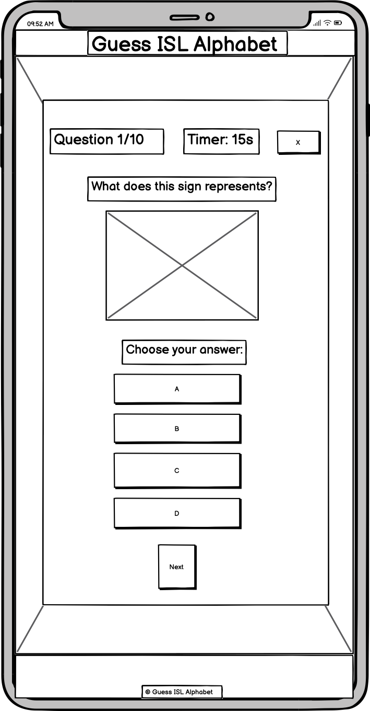
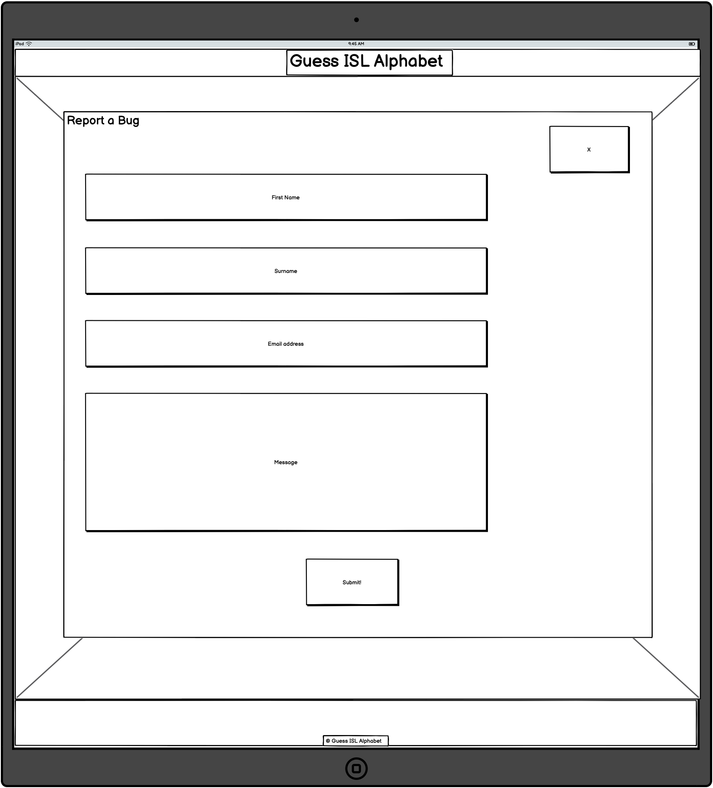
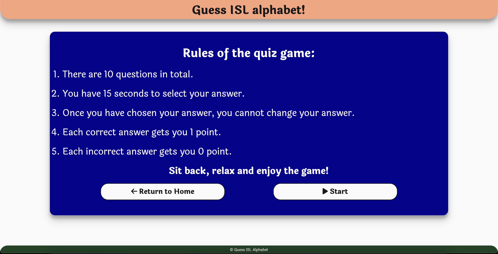

# [GUESS INDIAN SIGN LANGUAGE ALPHABET](https://robizman.github.io/guess-indian-sign-lang-alphabet)

[](https://github.com/RoBizMan/guess-indian-sign-lang-alphabet/commits/main)
[](https://github.com/RoBizMan/guess-indian-sign-lang-alphabet/commits/main)
[](https://github.com/RoBizMan/guess-indian-sign-lang-alphabet)

### Introduction

Participate in our interactive quiz game to improve your skills with the ISL fingerspelling alphabet. Through interactive and challenging quizzes, you can improve your understanding and fluency in ISL fingerspelling, promoting inclusivity and accessibility in communication.

This project aims to develop an interactive online quiz game for learning and practising the Indian Sign Language (ISL) fingerspelling alphabet. It aims to ensure ISL learning is accessible and enjoyable while also promoting inclusivity and community communication. Through gamification, the project seeks to enhance users' retention and understanding of ISL fingerspelling, ultimately contributing to their language proficiency. Also, this is part of the second portfolio project of the Code Institute course.

#### Target Audience ⁤

Our main target audience consists of people who want to learn ISL, including students, educators, interpreters, and friends or family members who use ISL. If you are interested in language learning and inclusivity or just want a fun and educational challenge, the game is for you.

#### Value Proposition ⁤

Discover a fun and interactive way to master the ISL fingerspelling alphabet through our unique quiz game. We enhance engagement and effectiveness by gamifying the learning process. Regardless of your skill level, our game is a valuable tool for improving your ISL fingerspelling abilities.


[Click here to view the Live website](https://robizman.github.io/guess-indian-sign-lang-alphabet)

## Table of contents

1. [Introduction](#introduction)
1. [UX](#ux)
    1. [Five Planes of User Experience](#five-planes-of-user-experience)
        * [The Strategy Plane](#the-strategy-plane)
        * [The Scope Plane](#the-scope-plane)
        * [The Structure Plane](#the-structure-plane)
        * [The Skeleton Plane](#the-skeleton-plane)
        * [The Surface Plane](#the-surface-plane)
    1. [Colour Scheme](#colour-scheme)
    1. [Typography](#typography)
1. [User Stories](#user-stories)
    1. [New Site Users](#new-site-users)
    1. [Returning Site Users](#returning-site-users)
1. [Wireframes](#wireframes)
    1. [Mobile wireframe](#mobile-wireframes)
    1. [Tablet wireframe](#tablet-wireframes)
    1. [Desktop wireframe](#desktop-wireframes)
1. [Features](#features)
    1. [Existing Features](#existing-features)
    1. [Future Features](#future-features)
1. [Tools & Technologies Used](#tools--technologies-used)
1. [Testing](#testing)
1. [Deployment](#deployment)
    1. [Local Deployment](#local-deployment)
        * [Cloning](#cloning)
        * [Forking](#forking)
    1. [Local vs Deployment](#local-vs-deployment)
1. [Credits](#credits)
    1. [Content](#content)
    1. [Media](#media)
    1. [Acknowledgements](#acknowledgements)
***

## UX

In this project, I follow the Five Planes of User Experience model invented by Jesse James Garrett.

### Five Planes of User Experience

This model aids in transforming from abstract ideas, such as creating objectives of the project and identifying the user needs, to concrete concepts, such as assembling visual elements together to produce the visual design of the idea to meet the project's objectives and users' needs.

#### The Strategy Plane

Indian Sign Language (ISL) has recently been brought to the attention of people in India. The Prime Minister of India, Narendra Modi, made it part of the school curriculum. Also, Narendra Modi launched the first official ISL dictionary, which consists of 4,000 signs. They have launched the third edition of ISL, bringing the total number of signs to 10,000 so far.

Users may look for ISL gamification. Therefore, the main objective of this project is to create a gamification website that encourages users to learn and practice ISL fingerspelling alphabet as a first step in learning ISL. Also, a gamification website includes an external resource for users to learn ISL further. Thus, this project aims to meet the business and the user's needs.

#### The Scope Plane

Based on the main objective and goals set out in the Strategy Plane, these requirements for developing the website are broken down into two categories:

##### Content requirements:
- Gamification ISL fingerspelling alphabet
- Facts about ISL
- External resources to learn ISL further

##### Functionality requirements:
- Easy and interactive gamification
- Easy to navigate the gamification website
- Provide an external link to get more resources for learning ISL

#### The Structure Plane

The requirements outlined in the Scope Plane were then used to create a structure for the website. A site map below shows how users can navigate the website easily.


#### The Skeleton Plane

Please refer to the [Wireframes](#Wireframes) section for more detailed wireframing.

#### The Surface Plane

[Click here to view the live site.](https://robizman.github.io/guess-indian-sign-lang-alphabet)

### Colour Scheme

I used [Color Hunt](https://colorhunt.co/palette/f9a37b06038dfafafa1a4223#justCreated) to generate my colour palette


The colour palette represents the flag of India. However, it was crucial for the colour palette to pass the minimum colour contrast set by the Web Content Accessibility Guide (WCAG). The colour palette was tested using [Coolors' Color Contrast Checker](https://coolors.co/contrast-checker/). The result below shows that these colours passed the minimum WCAG contrast ratio.

<details>
<summary>Color Contrast Checker</summary>


</details>

<br>
I have used CSS `:root` variables to easily update the global colour scheme by changing only one value, instead of everywhere in the CSS file.

```css
:root {
    --saffron: #F9A37B;
    --white: #FAFAFA;
    --green: #1A4223;
    --navy: #06038D;
    --black: #191919;
}
```

### Typography

Laila was chosen as the main font for the whole website. The font was imported from Google Fonts. The font makes the website look and feel cartoony and fun.

Arial and sans-serif were used as step-back fonts if Hind Vadodara failed to load on the website.

## User Stories
### New Site Users

- As a new user, I want to understand how to play the game, so that I can start learning ISL fingerspelling.

- As a new user, I want to be able to see the result, so that I can track my performance.

- As a new user, I want to be able to replay the game, so that I can practice and improve my skills.

### Returning Site Users

- As a returning user, I want to find resources to learn ISL further.

- As a returning user, I want to see new and varied questions each time, so that my learning continues to be challenged.

- As a returning user, I want to be able to share my scores, so that I can challenge my friends to beat my score.

## Wireframes

To follow best practice, wireframes were developed for mobile, tablet, and desktop sizes.

I have used [Balsamiq](https://balsamiq.com/wireframes) to design my site wireframes.

### Mobile Wireframes
<details>
<summary>Mobile Wireframes</summary>





</details>

### Tablet Wireframes
<details>
<summary>Tablet Wireframes</summary>



</details>

### Desktop Wireframes
<details>
<summary>Desktop Wireframes</summary>


</details>

## Features

### Existing Features

#### The Home Page
The Home Page is the first contact users will encounter when visiting this website. The page appears with the title welcoming users to the website. Also, there are three buttons that leads users to the Rules page, the Facts page, and the Contact page. [Click here to view the home page](https://robizman.github.io/guess-indian-sign-lang-alphabet/index.html)


#### Header

At the top of the website is the header appears the name of the website.


#### Footer

The footer is at the bottom of the website appears the copyright message.


#### The Rules page

The Rules page explains the rules of the game. There are two buttons that leads users back to the Home page or continue to the Game page to start the game. [Click here to view the Rules page](https://robizman.github.io/guess-indian-sign-lang-alphabet/rules.html)



#### The Game page

The Game page is where the user can play the game. The top of the box container consists of the current question number, the countdown timer of 15 seconds, and the X button to quit the game. In addition, the image appears in the centre of the box container, which shows ISL fingerspelling alphabet for users to guess. At the bottom of the box container consists of four answer buttons for users to choose one of four buttons. Once user choose their answer, it will appear a green colour to indicate that this is a correct answer. Otherwise, it would appear a red colour to indicate that this is a wrong answer, and a green colour to show which answer was correct. Then, the next button will appear to allow users to move to the next question. Upon the completion of the game, the result container will appear and give users choice to restart the game or quit to the home page. The game quiz was also made for responsive across different screen sizes. [Click here to view the Game page](https://robizman.github.io/guess-indian-sign-lang-alphabet/game.html)


- Tablet version


- Mobile version


#### The Facts page

The Facts page features a short list of facts about ISL. There are two buttons that take users back to the home page or take users to the external link (Indian Sign Language Research and Training Centre) for more ISL learning resources. [Click here to view the Facts page](https://robizman.github.io/guess-indian-sign-lang-alphabet/facts.html)


#### The Contact page

The Contact page features a contact form for users to input their first name, surname, email address, and message. This page enables users to contact the website's owner directly. Also, there is a button that users need to click to send their form to the website's owner. Once a user submits the contact form, the confirmation container to confirm that their contact form was submitted successfully. The users will be redirected to the home page automatically after 10 seconds. [Click here to view the Contact page](https://robizman.github.io/guess-indian-sign-lang-alphabet/contact.html)


### Future features

- Offers three different levels of difficult - easy (10 questions), medium (18 questions), and hard (26 questions).
- The dark mode toggle shall be implemented on the website to give users an option to enable a dark mode on this website.
- Add fingerspelling numbers to the game quiz.
- Add basic signs to the game quiz.
- Create visual appealing modals to reduce number of pages needed to go through.